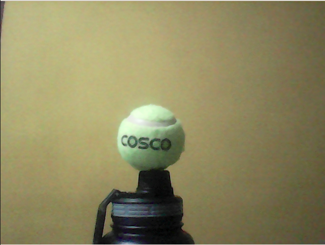
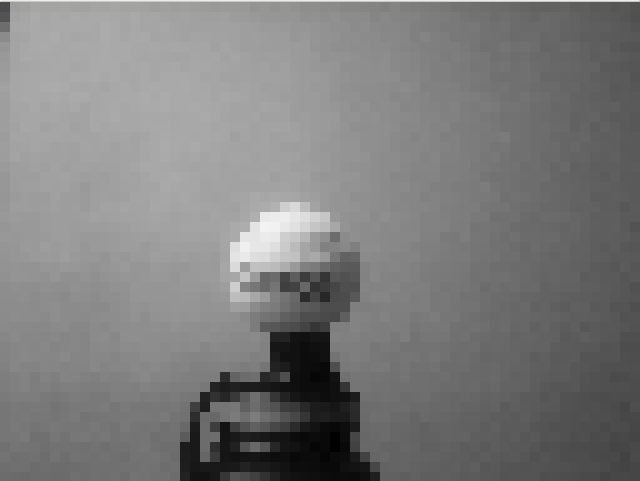
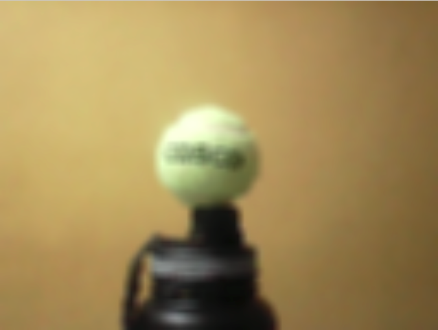

# Blurry-cam

A project to blur/pixelate your webcam.

### Jumping right in

To start with I looked around the web to see if someone had already made a project to blur my webcam. Maybe there was an npm package roaming the wilds, waiting to do the job for me? Nope, no luck. 

Fortunately, a month or so back, I read [this](https://elder.dev/posts/open-source-virtual-background/) amazing post on how the author had done some processing on his webcam feed for some outstanding results. If you haven't read it yet, I recommend you do so when you can! I used that post quite a lot while writing this nifty script.

We're using opencv, so you can install that with:
```zsh
$ pip install opencv-contrib-python
```
You'll now need to find your webcam.
```
$ ls /dev | grep video
video0
video1
```
Plug these in to the script below.

```python
import cv2

# Capture device
cap = cv2.VideoCapture('/dev/video0')

success, frame = cap.read()

# Preview frame
cv2.imshow('frame', frame)
cv2.waitKey()
```

Mine turned out to be `video0`. If all was successful, you should be greeted with a still frame from your webcam.

You can set the capture options you'd like using the following:
```python
height, width = 480, 640

cap.set(cv2.CAP_PROP_FRAME_WIDTH , width)
cap.set(cv2.CAP_PROP_FRAME_HEIGHT, height)

# Can be set even lower if you'd like. Will add to the realism ;)
cap.set(cv2.CAP_PROP_FPS, 30)
```

Now, to feed this to a fake webcam, you'll need `pyfakewebcam` and `v412loopback`.
```zsh
$ pip install pyfakewebcam

$ sudo apt install v4l2loopback-dkms

# -r : show possible aliases
$ sudo modprobe -r v4l2loopback

# devices=1 : we want to create one fake webcam only
# video_nr=20 : this sets the device as /dev/video20
# card_label : label of device. Feel free to rename
# exclusive_caps=1 : this is required for the webcam to work on Chrome, etc.
$ sudo modprobe v4l2loopback devices=1 video_nr=20 card_label="v4l2loopback" exclusive_caps=1
```
This will create a `/dev/video20` if it encoutered no errors.

To initialize the fake webcam,
```python
fake = pyfakewebcam.FakeWebcam('/dev/video20', width, height)
```
Apparently, OpenCV uses BGR color scheme for image operations, but pyfakewebcam expects RGB. Thus,
```python
rgbframe = cv2.cvtColor(frame, cv2.COLOR_BGR2RGB)
fake.schedule_frame(rgbframe)
```

Now, how do you pixelize or blur the frame? I don't know OpenCV, but some quick googling found me a SO answer [here](https://stackoverflow.com/a/55509210) and the `cv2.blur()` function.

It feels like making a magic potion at this point. Here is the final script:
```python
import cv2
import pyfakewebcam

# Capture device
cap = cv2.VideoCapture('/dev/video0')

height, width = 480, 640

newHeight, newWidth = height // 5, width // 5

cap.set(cv2.CAP_PROP_FRAME_WIDTH , width)
cap.set(cv2.CAP_PROP_FRAME_HEIGHT, height)
cap.set(cv2.CAP_PROP_FPS, 30)

# Initialize webcam
fake = pyfakewebcam.FakeWebcam('/dev/video20', width, height)

while cap.isOpened():

    _, frame = cap.read()
    

    # To convert to grayscale
    # frame = cv2.cvtColor(frame, cv2.COLOR_BGR2GRAY)
    
    # Pixelize image by resizing to newWidth and newHeight and back
    temp = cv2.resize(frame, (newWidth, newHeight), interpolation=cv2.INTER_LINEAR)
    frame = cv2.resize(temp, (width, height), interpolation=cv2.INTER_NEAREST)

    # Blur image - increase the numbers below to increase the blur
    frame = cv2.blur(frame, (25, 25))

    # Send frame to fake webcam
    rgbframe = cv2.cvtColor(frame, cv2.COLOR_BGR2RGB)
    fake.schedule_frame(rgbframe)

    # Uncomment this to see a preview window
    # cv2.imshow('frame', frame)
    # if cv2.waitKey(1) & 0xFF == ord('q'):
    #     break

else:
    print("Unable to open capture device.")

# When everything done, release the capture
cap.release()
cv2.destroyAllWindows()
```
### Finally

Here's a screenshot of my webcam with no filters applied:


And here's a pixelized grayscale version with the width and height set to 1/10th of the original.


This one is pixelized to 1/5th of the original, then blurred.


### FAQ

#### What's the point of this?
Good question. Maybe you just woke up from bed, and don't want it to be obvious to your boss. Or you just don't want to give that NSA agent an HD view of yourself. Whatever the case, I guarantee that this will be a handy tool in your toolbelt.

####  Why would I want to make my already blurry laptop webcam even blurrier?
I can almost hear the sarcasm in your voice. Yes, I have no idea why laptop manufacturers are manufacturing 20th century webcams for 21st century laptops, maybe go post in their forums instead.

#### Is this script meant to be run on Windows?
I haven't tried, but I genuinely wonder where you're going to find `/dev/video0` or `modprobe`

#### Is any part of this script original? It feels like you've take snippets from around the web and combined it to form this abomination.
Haha, you may have a point. It's known that normal programmers google while programming, but it looks like I program using just  google ¯\\\_(ツ)\_/¯

#### Where's #Installation? Why are you forcing me to read all this? Why isn't this README following the usual norms?
Feel free to open a PR bruv
